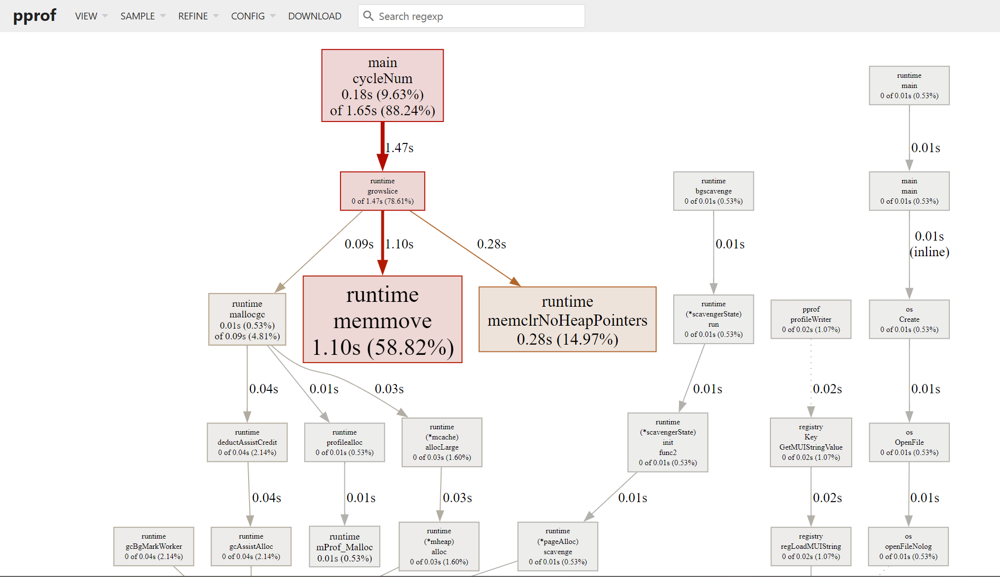
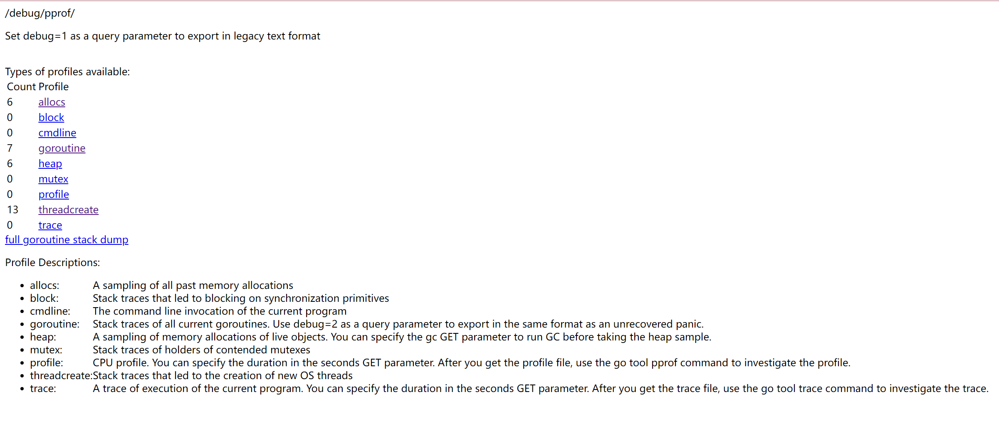

# pprof

pprof 是 golang 官方提供的性能调优分析工具，可以对程序进行性能分析，并可视化数据.

pprof开启后，每隔一段时间（10ms）就会收集下当前的堆栈信息，获取各个函数占用的CPU以及内存资源；最后通过对这些采样数据进行分析，形成一个性能分析报告。

本文只介绍 pprof 图形可视化分析，命令行看着费劲，直接看图更直观。

> 只应该在性能分析时开启 pprof，因为 pprof 会影响程序的性能。
> 
> 测试时可以使用命令行参数或环境变量告诉程序应当开启 pprof

## 环境配置

首先需要安装 [graphviz](https://graphviz.org/download/) ，用于生成图片。

下载对应的平台安装包，安装完成后，把 bin 目录放入 Path 环境变量中。

在命令行中输入 `dot -V`，如果显示版本号，则安装成功。

下面以 Windows 为例，演示使用方式。

## 参数说明

| 字段   | 说明                                                |
| ------ | --------------------------------------------------- |
| flat   | 当前函数占用 cpu 耗时                               |
| flat % | 当前函数占用 cpu 耗时百分比                         |
| sum%   | 函数占用 cpu 时间累积占比，从小到大一直累积到 100%  |
| cum    | 当前函数加上调用当前函数的函数占用 cpu 的总耗时     |
| %cum   | 当前函数加上调用当前函数的函数占用 cpu 的总耗时占比 |

## 工具类应用

参考 [utility_application](utility_application/main.go) 使用 pprof 进行性能分析。

使用 `go tool pprof 文件名` 打开生成的文件，在终端执行 web 命令，会生成一个 svg 图像。

1. 每个框代表一个函数，理论上框越大表示占用的 cpu 资源越多
2. 每个框之间的线条代表函数之间的调用关系，线条上的数字表示函数调用的次数
3. 每个框中第一行数字表示当前函数占用 cpu 的百分比，第二行数字表示当前函数累计占用 cpu 的百分比

或者直接使用 `go tool pprof -http` 指定端口和文件路径，即可在浏览器中查看性能分析报告。 
```bash
go tool pprof -http=:6060 .\cpu.prof
```

```bash
go tool pprof -http=:6060 .\mem.prof
```

然后就可以在 http://localhost:6060/ui/ 看到可视化页面。



## 服务类应用

启动一个 Goroutine 来监听 `:6060` 端口，这个服务是用来提供 pprof 数据的。虽然没有显式地为 pprof 注册任何处理器，但导入 `net/http/pprof` 包时，它会自动注册一系列标准路径来提供性能分析数据。

```go
package main

import (
    "log"
    "net/http"
    _ "net/http/pprof"
    "sync"
    "time"
)

var data [][]byte

func updateData(wg *sync.WaitGroup) {
    defer wg.Done()
    for range 10 {
       data = append(data, make([]byte, 1024*1024))
       time.Sleep(500 * time.Millisecond)
    }
}

func main() {

    go func() {
       log.Println(http.ListenAndServe(":6060", nil))
    }()

    http.HandleFunc("/", func(w http.ResponseWriter, r *http.Request) {
       var wg sync.WaitGroup
       wg.Add(1)
       go updateData(&wg)
       wg.Wait()
       w.Write([]byte("ok"))
    })

    // 开启http服务
    log.Println("server start at :8080")
    log.Fatal(http.ListenAndServe(":8080", nil))
}
```

- `http://localhost:6060/debug/pprof/` - pprof 的主页，列出了可用的性能分析数据类型。
- `http://localhost:6060/debug/pprof/goroutine` - 当前所有 Goroutine 的堆栈跟踪。
- `http://localhost:6060/debug/pprof/heap` - 当前堆内存的使用情况。
- `http://localhost:6060/debug/pprof/profile` - CPU 性能分析数据，默认进行 30s 的采样。
- `http://localhost:6060/debug/pprof/block` - 阻塞操作的堆栈跟踪。
- `http://localhost:6060/debug/pprof/mutex` - 锁的竞争情况。



点击 `profile` 就会开始30s的采样，30s后会生成一个文件，可以使用`go tool pprof -http=:6061 .\profile` 在浏览器打开并分析性能指标。

如果想要自定义采样时间，在浏览器输入`http://localhost:6060/debug/pprof/profile?seconds=5 ` 类似这样的内容。

也可以不另起一个goroutine，如果是自定义的mux，可以自己注册上 pprof 的路由规则

```go
r.HandleFunc("/debug/pprof/", pprof.Index)
r.HandleFunc("/debug/pprof/cmdline", pprof.Cmdline)
r.HandleFunc("/debug/pprof/profile", pprof.Profile)
r.HandleFunc("/debug/pprof/symbol", pprof.Symbol)
r.HandleFunc("/debug/pprof/trace", pprof.Trace)
```

gin 框架可以使用 https://github.com/gin-contrib/pprof 来注册 pprof 相关路由